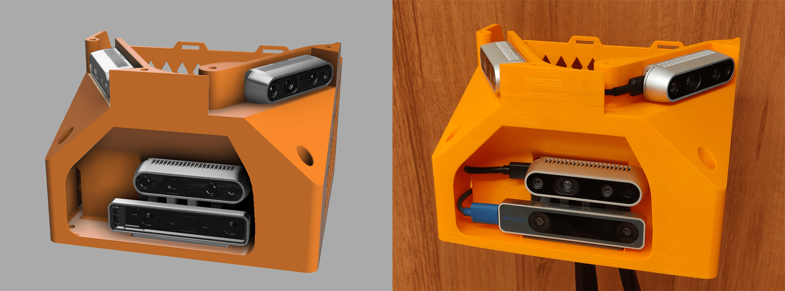

# Xavier-SLAM-module
Warning: currently doesn't work on Xavier. Recommend platforms based on x86 architecture.

<p align="center">
  
</p>

1. On your master computer, check master computer local IP address, and add it to your ~/.bashrc file
```
gedit ~/.bashrc
export ROS_MASTER_URI=http://<masterIP>:11311
export ROS_IP=<masterIP>
source ~/.bashrc
```

2. Then, launch roscore (or launch Rviz to view octomap data)
```
roscore
```
or
```
source devel/setup.bash
roslaunch realsense_node_python octomap_viewer.launch
```

3. Log into your mobile computer of choice
```
ssh <username>@<mobileIP>
```

4. On your mobile computer, check mobile computer local IP address, and add it to your ~/.bashrc file
```
gedit ~/.bashrc
export ROS_MASTER_URI=http://<masterIP>:11311
export ROS_IP=<mobileIP>
source ~/.bashrc
```

5. Then, launch octomap
```
source devel/setup.bash
roslaunch realsense_node_python octomap_realsense.launch
```

Octomap resolution and other parameters can be changed in octomap_realsense launch file.

## Used repositories:
- [realsense_nodes_python](https://github.com/Michal-Bidzinski/realsense_nodes_python)
- [Multiple-Realsense-D435](https://github.com/jakubmuszynski/Multiple-Realsense-D435)
- [octomap_mapping](https://github.com/OctoMap/octomap_mapping)
